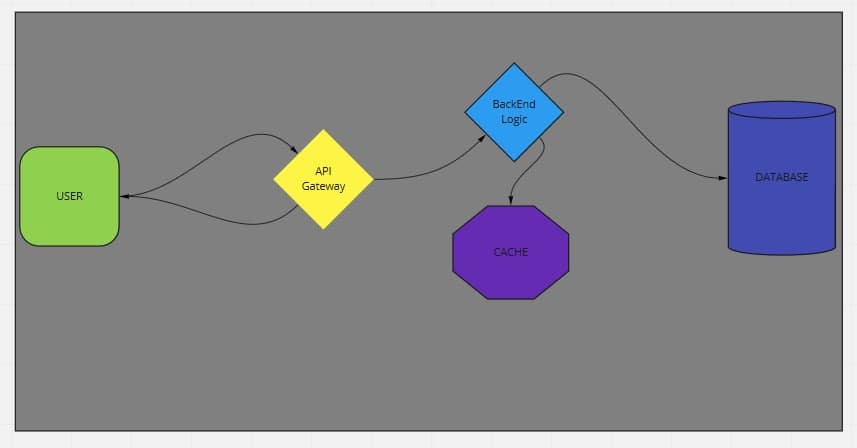
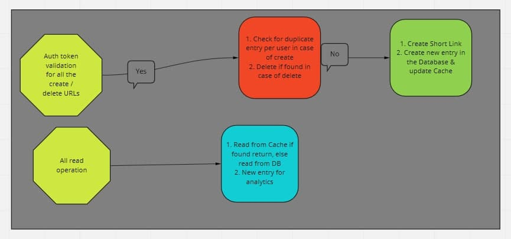

# Requirement (Functional)

1. System should create an unique URL link for each input per user.
2. System should return the original URL when requested with SHORT URL.
3. User can delete the shortened link.
4. Analytics

    a. Total number of reads via SHORT URL.

    b. Total number of reads via SHORT URL per day.
    
    c. Total number of unique users.
    
    d. Total number of user users per day.

# Requirements (Non-functional):

1. Sytem should be highly available.
2. Fetching of original URL should be fast.
3. Short URL should not be guessable.


# Flow Diagram






### Note: Read:Write of system as per problem statement is 10:1

# Space Estimate

Assuming we are going to store all the shortened URL for 3 years.

Total projected URLs = 1000 * 10 * 3 * 365 = 1.1X10^6 = 1.1M

Also, assuming the each short URL will consume 500 bytes per URL in data storage

500 bytes * 1.1M =  6 GiB

# Memory Estimate

Since this is read heavy system, I would like to store the shortened URL in cache to serve the user faster.

10K entries per day * 500 Bytes = 2.5 GiB per day

# Network Estimate

The data transfer for read

Total read request = 100K * 500 bytes = 2.5MiB/sec

The data transfer for write

Total write request = 10K * 500 byetes = 2.5KiB/sec

# Availbale End Points

1. POST v1/create

Request Param
```
{
    "long_url" : "https://example.com/value_added_links"
}
```

Response Param

```
{
    "message": "Short URL Created",
    "short_url": "lin.ks/xKcD",
    "long_url": "https://example.com/value_added_links"
}
```

2. POST v1/update

Request Params 
```
{
    "short_url" : "lin.ks/xKcD"
}
```

Response Param

```
{
    "short_url" : "lin.ks/Cf39",
    "message": "Short URL Updated"
}
```

3. DELETE v1/delete

Request Params
```
{
    "url" : "https://example.com"
}
```

Response Params
```
{
    "message": "Short URL Deleted"
}
```

4. GET v1/clicks?type="Day/Total"

Response Params
```
{
    "message": "Short URL Deleted"
}
```

5.  GET v2/people?type="Day/Total"

Response Params
```
{
    "message": "Short URL Deleted",
    "count": <some_value>,
    "type": <Day/Total>

}
```